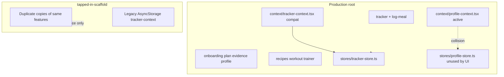
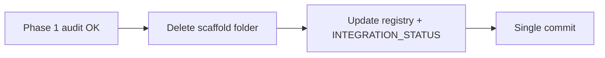
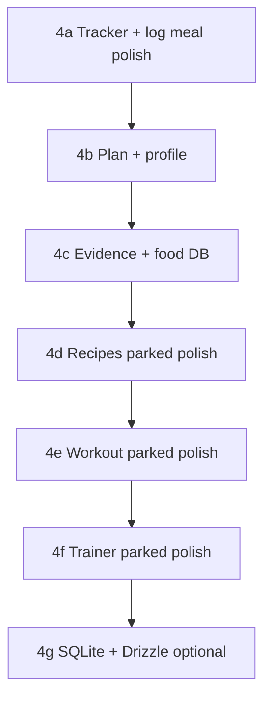

# Claude Code cleanup and refinement workflow

## Current state (what you have today)



| Area | Status |
|------|--------|
| Tracker / log meal | In root, working; Zustand is canonical ([`stores/tracker-store.ts`](stores/tracker-store.ts)); [`context/tracker-context.tsx`](context/tracker-context.tsx) is a **compat wrapper** (no-op `TrackerProvider`) |
| Recipes / workout / trainer | **Already copied to root**; tabs stay visible per your choice |
| Scaffold | Full duplicate tree (~46 files); **safe to delete** after a 15-minute diff audit |
| “Wrappers” to clean | `useTracker()` shim, `profile-context` vs unused `profile-store`, inline `AsyncStorage` shims in workout/trainer ([`app/(tabs)/workout.tsx`](app/(tabs)/workout.tsx)) |
| Repo junk | [`tracked_files.txt`](tracked_files.txt), [`pi-session-*.html`](pi-session-2026-05-04T14-11-50-711Z_019df354-bf34-75ef-99c6-6e0e14a647ac.html), possibly [`build.log`](build.log) |
| Docs drift | Food tab referenced in [`claude.md`](claude.md) / registry but **`app/(tabs)/food.tsx` does not exist** |

You do **not** need to “upload” the whole repo to Claude Code if you open the project locally. Claude reads the working tree + [`CLAUDE.md`](claude.md) automatically.

---

## What to give Claude Code first (Session 0 — setup, no code changes)

**Open:** repo root `tapped-in/` (not `tapped-in-scaffold/`).

**Create locally (if missing):**

1. [`.claudeignore`](docs/CURSOR_IGNORE.md) — same patterns as [docs/CURSOR_IGNORE.md](docs/CURSOR_IGNORE.md): exclude `tapped-in-scaffold/`, `node_modules/`, `assets/`, `*.log`, `pi-session-*.html`
2. Optional: add a **10-line router** at the top of [`CLAUDE.md`](claude.md) pointing to [`INTEGRATION_STATUS.md`](INTEGRATION_STATUS.md) and [`docs/feature-registry.yaml`](docs/feature-registry.yaml) (full `claude.md` is ~1000 lines; Claude will read it all unless you trim or ignore sections)

**First prompt to paste (copy as-is):**

```text
PROJECT: Tapped In — production = repo root only.
READ FIRST: INTEGRATION_STATUS.md, docs/feature-registry.yaml, docs/AGENT_TASK.md
DO NOT: edit tapped-in-scaffold/ unless I say SOURCE=scaffold

TASK: Audit only — no code changes.
1. List any files that exist ONLY under tapped-in-scaffold/ (not duplicated in root).
2. List compat wrappers to remove (tracker-context, profile dual-state, AsyncStorage shims).
3. List repo junk safe to delete (tracked_files.txt, pi-session html, build.log).
4. Confirm recipes/workout/trainer root copies are sufficient to delete scaffold.
Output a numbered checklist I can approve before deletion.
```

**Do not** start with “analyze the whole repo” or “read claude.md end-to-end” — the three docs above are enough for session 0.

---

## Phase 1 — Scaffold exit audit (before delete)

**Goal:** Prove nothing unique remains in scaffold.

| Step | Action |
|------|--------|
| 1.1 | Run audit prompt above (or `npm run feature-context -- tracker` for slice context) |
| 1.2 | Manually diff only if audit flags gaps: compare scaffold vs root for [`app/log-meal.tsx`](app/log-meal.tsx), [`components/OilCheckModal.tsx`](components/OilCheckModal.tsx), [`data/foods.ts`](data/foods.ts) |
| 1.3 | Expected result: **no unique production logic** — scaffold is Replit prototype with real `AsyncStorage` in [`tapped-in-scaffold/context/tracker-context.tsx`](tapped-in-scaffold/context/tracker-context.tsx); root already superseded |

[`data/arjun.ts`](data/arjun.ts) already exists in root (trainer uses it); scaffold copy is redundant.

**Gate:** You approve the audit checklist → only then delete scaffold.

---

## Phase 2 — Delete `tapped-in-scaffold/` (Session 1 — single focused PR)

**Claude prompt:**

```text
FEATURE: migration
READ FIRST: INTEGRATION_STATUS.md

TASK: Delete tapped-in-scaffold/ entirely.
- Remove folder and all references in docs (feature-registry scaffold_paths, INTEGRATION_STATUS scaffold section).
- Keep tsconfig exclude or remove if folder gone.
- Do not change app behavior.
- Run typecheck if available.

ACCEPTANCE: No tapped-in-scaffold path in repo; docs say "scaffold removed 2026-XX".
```

**After delete:** Git tag or commit message like `chore: remove reference scaffold` so you can recover from history if needed.



---

## Phase 3 — Clean wrappers and clutter (Session 2–3)

Do in **small commits**, one concern each.

### 3a. Tracker wrapper (highest-value cleanup)

| Current | Target |
|---------|--------|
| [`context/tracker-context.tsx`](context/tracker-context.tsx) `useTracker()` | Direct [`useTrackerStore`](stores/tracker-store.ts) selectors in [`app/(tabs)/index.tsx`](app/(tabs)/index.tsx), [`app/log-meal.tsx`](app/log-meal.tsx), [`app/(tabs)/trainer.tsx`](app/(tabs)/trainer.tsx) |
| No-op `TrackerProvider` | Already removed from [`app/_layout.tsx`](app/_layout.tsx) — delete dead exports |

**Claude prompt:**

```text
FEATURE: tracker
READ FIRST: docs/features/tracker.md, docs/TYPESCRIPT_STACK_MIGRATION.md
TASK: Remove tracker-context.tsx — switch all imports to useTrackerStore / useTrackerActions.
Preserve behavior: viewingKey, deleteMeal across days, legacy key migration stays in tracker-store.
DO NOT: touch recipes/workout/trainer except trainer's useTracker import.
```

### 3b. Profile wrapper (stack migration #2)

[`stores/profile-store.ts`](stores/profile-store.ts) exists but **no screen imports it** — only [`context/profile-context.tsx`](context/profile-context.tsx) is wired in [`app/_layout.tsx`](app/_layout.tsx).

**Claude prompt:**

```text
FEATURE: profile
READ FIRST: docs/TYPESCRIPT_STACK_MIGRATION.md
TASK: Migrate ProfileProvider + useProfile() consumers to profile-store.
Remove profile-context.tsx when done. Single storage key tapped_in_profile.
Verify: onboarding step5, results, profile tab, index tracker targets, workout profile read.
```

### 3c. Workout/trainer storage shims (clutter, not feature polish)

Root workout files use a local `const AsyncStorage = { getItem: ... storage }` pattern. Extract once to [`lib/storage.ts`](lib/storage.ts) e.g. `storageAsyncShim` and import — removes duplicate blocks in 4+ files.

**Do not** refactor workout UX yet — storage shim only.

### 3d. Repo junk (safe deletes)

| File | Action |
|------|--------|
| [`tracked_files.txt`](tracked_files.txt) | Delete (artifact, not source of truth) |
| `pi-session-*.html` | Delete + add to `.gitignore` |
| [`build.log`](build.log) | Delete if present |
| Duplicate docs | Keep [`AGENTS.md`](AGENTS.md) + lean router in [`CLAUDE.md`](claude.md); avoid editing both with conflicting specs |

---

## Phase 4 — Feature refinement (Session 4+, after clutter)

Order matches your priorities and [INTEGRATION_STATUS.md](INTEGRATION_STATUS.md). **Keep recipes/workout/trainer tabs visible** — refine behavior only when you reach each feature.



| Wave | FEATURE id | Focus | Out of scope |
|------|------------|-------|----------------|
| **4a** | `tracker` / `log_meal` | FlashList if needed, selector perf, oil flow edge cases, Gemini error UX | Engine math |
| **4b** | `plan_results` / `profile` | Deficit preference bug, evidence links, redo plan | SQLite |
| **4c** | `evidence_science` | Missing food tab: **add** [`app/(tabs)/food.tsx`](app/(tabs)/food.tsx) or remove from docs | — |
| **4d–f** | `recipes` / `workout` / `trainer` | MMKV keys, Ionicons→Feather if desired, brand voice | Supabase, AI trainer scale |
| **4g** | stack | `lib/db/` per [PRD.md](PRD.md) | Only after 4a stable |

**Per-session Claude template:**

```text
FEATURE: <id>
READ FIRST: docs/feature-registry.yaml, docs/features/<id>.md, INTEGRATION_STATUS.md
SCOPE: <exact files>
DO NOT: <other features>
ACCEPTANCE: <user-visible behavior> + typecheck
```

One feature per session keeps diffs reviewable.

---

## How to move session-to-session

| After you finish… | Next session starts with… |
|-----------------|---------------------------|
| Setup | Phase 1 audit prompt (read-only) |
| Audit approved | Phase 2 scaffold delete |
| Scaffold gone | Phase 3a tracker wrapper removal |
| Tracker direct store | Phase 3b profile-store migration |
| Wrappers clean | Phase 3d junk delete |
| Clutter clean | Phase 4a tracker refinement (your first *product* work) |

**Between sessions:** update [`INTEGRATION_STATUS.md`](INTEGRATION_STATUS.md) checkboxes so Claude does not re-audit solved work.

**Commits:** one logical change per commit (`chore: remove scaffold`, `refactor: tracker zustand direct`, `refactor: profile store`).

---

## What NOT to do early

- Do not run SQLite + Drizzle before tracker/profile storage is single-path
- Do not polish recipes/workout/trainer before 4a–4b (tabs stay visible but behavior can stay “parked”)
- Do not delete `context/*` and `stores/*` in the same commit (hard to bisect)
- Do not ask Claude to read all of `claude.md` when `docs/feature-registry.yaml` + feature slice docs exist

---

## Success criteria (you’re “ready to build features”)

- [ ] `tapped-in-scaffold/` gone from repo
- [ ] No `useTracker()` / dual profile context — stores are canonical
- [ ] `.claudeignore` excludes noise
- [ ] Junk files removed from git
- [ ] `INTEGRATION_STATUS.md` reflects scaffold removed + wrapper cleanup done
- [ ] First refinement session is **FEATURE: tracker** only
