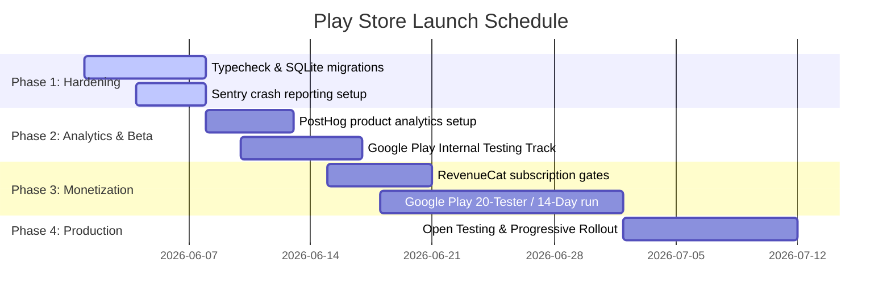

# docs/PLAY_STORE_LAUNCH_PLAN.md — Google Play Store Launch & Codebase Organization Plan

> Structured roadmap to organize, harden, and optimize Tapped In for production release on Android.
> **Last updated:** June 2026

---

## 1. Codebase Organization & Decluttering

To ensure compilation efficiency and clean dependency boundaries, we perform a thorough codebase audit before initiating the Play Store release build:

- [ ] **Remove Temp Caches:** Add `.expo/`, `.metro/`, and `node_modules/` to `.gitignore` and `.cursorignore`. 
- [ ] **Archive Unused Prototypes:** All features have been migrated to the root space. Ensure no leftover scaffold folders exist in Git.
- [ ] **Prune package.json:** Audit dependencies to ensure no duplicate packages (e.g. avoiding both `react-native-vector-icons` and `lucide-react-native`).
- [ ] **Exclude Build logs:** Ensure all `metro.log`, `debug.log`, and `build.log` files are ignored and deleted.

---

## 2. Android Native Build Configurations

Android builds will be managed via **EAS (Expo Application Services) Build** to produce a production-ready `.aab` (Android App Bundle).

### 2.1 app.json Customizations
Configure `app.json` with strict package names, permissions, and compilation flags:

```json
{
  "expo": {
    "name": "Tapped In",
    "slug": "tapped-in",
    "version": "1.0.0",
    "orientation": "portrait",
    "icon": "./assets/icon.png",
    "userInterfaceStyle": "dark",
    "splash": {
      "image": "./assets/splash.png",
      "resizeMode": "contain",
      "backgroundColor": "#0D0F1C"
    },
    "ios": {
      "supportsTablet": false,
      "bundleIdentifier": "com.tappedin.app"
    },
    "android": {
      "package": "com.tappedin.app",
      "versionCode": 1,
      "adaptiveIcon": {
        "foregroundImage": "./assets/adaptive-icon.png",
        "backgroundColor": "#0D0F1C"
      },
      "permissions": [
        "CAMERA",
        "RECORD_AUDIO"
      ]
    },
    "plugins": [
      [
        "expo-image-picker",
        {
          "photosPermission": "Allow Tapped In to scan food photographs."
        }
      ],
      [
        "expo-camera",
        {
          "cameraPermission": "Allow Tapped In to scan barcodes."
        }
      ],
      [
        "expo-build-properties",
        {
          "android": {
            "enableNewArchitecture": true,
            "packagingOptions": {
              "pickFirst": ["**/libturbojpeg.so"]
            }
          }
        }
      ]
    ]
  }
}
```

### 2.2 Proguard Obfuscation & Bundling
- Enable **Proguard** inside `android/app/proguard-rules.pro` to reduce application bundle size and protect intellectual property by obfuscating Javascript-to-Native bridge calls.
- Optimize asset sizes using `.webp` compression for local image templates.

---

## 3. Production Supabase Auth & RLS Hardening

By shifting entirely to **Supabase Auth**, we eliminate secondary endpoints and secure data via direct Row Level Security (RLS) policies:

### 3.1 Row Level Security (RLS) Policies
Ensure direct user-isolation in PostgreSQL. No client can access logs belonging to another user:

```sql
-- Enable Row Level Security
ALTER TABLE profiles ENABLE ROW LEVEL SECURITY;
ALTER TABLE meal_logs ENABLE ROW LEVEL SECURITY;

-- Policies for profiles
CREATE POLICY "Users can view their own profile" ON profiles
  FOR SELECT USING (auth.uid() = id);

CREATE POLICY "Users can update their own profile" ON profiles
  FOR UPDATE USING (auth.uid() = id);

-- Policies for daily meal logs
CREATE POLICY "Users can view their own meal logs" ON meal_logs
  FOR SELECT USING (auth.uid() = user_id);

CREATE POLICY "Users can insert their own meal logs" ON meal_logs
  FOR INSERT WITH CHECK (auth.uid() = user_id);

CREATE POLICY "Users can delete their own meal logs" ON meal_logs
  FOR DELETE USING (auth.uid() = user_id);
```

### 3.2 Database Indexing for Streak & History Queries
Slow queries cause screen stutters on Android. Add targeted composite indexes in Supabase:
* Index on `meal_logs (user_id, date_key)` for quick daily logging loads.
* Index on `workout_logs (user_id, logged_at)` to support streak calendars and performance trends.

---

## 4. Play Store Performance Gates

Android devices span a wide hardware range. To guarantee a premium $60\text{fps}$ experience on mid-range Android hardware, we enforce these performance gates:

- [ ] **FlashList Estimated Size:** Ensure every `@shopify/react-native-flashlist` implements a highly accurate `estimatedItemSize` to prevent row recycled layout shifts.
- [ ] **Zustand Selector Checks:** Verify that no component subscribes to global stores without selector functions (`const field = useStore(s => s.field)`).
- [ ] **SQLite Batch Transactions:** Ensure the meal logger writes ingredients and oil logs inside a single SQLite transaction (`db.transaction(...)`) to prevent multiple sequential storage file writes.
- [ ] **Avoid Inline Render Calculations:** Derived macro computations (e.g. remaining calories) must be calculated inside selectors or pre-compiled database caches, never inline within the `render()` path.

---

## 5. Security & Secret Gates

- [ ] **Prune Client Secrets:** Verify that no development API keys (including raw Gemini API keys) are committed to Git.
- [ ] **EAS Secret Management:** Push all production endpoints and keys (`EXPO_PUBLIC_SUPABASE_URL`, `EXPO_PUBLIC_SUPABASE_ANON_KEY`) to EAS Environment Variables. They will be injected securely at build-time.
- [ ] **Google Play Console Signatures:** Create and backup a secure Keystore file. Manage signing keys inside EAS for automated bundle updates.

---

## 6. Type Safety & Validation Pipeline

Before submitting any build to the Google Play Store console:
1. Run `npm run typecheck` (`tsc --noEmit`) to verify strict type compliance.
2. Execute Metro bundler asset validations.
3. Validate database migrations inside SQLite to confirm old MMKV logs convert cleanly.

---

## 7. Third-Party SDK Integrations

To track stability, engagement, and revenue in production, we integrate three primary third-party SDKs, configured with strict dev/production environment boundaries:

### 7.1 Sentry (Crash Reporting & Stability)
* **Purpose:** Monitors JavaScript unhandled rejections and native crash events in production.
* **SDK:** `@sentry/react-native`
* **Configuration:**
  - Initialize in `app/_layout.tsx` wrapped inside a `__DEV__` guard (disable Sentry during local development to avoid polluting production error streams).
  - Configure the Sentry EAS Build plugin in `app.json` to automatically upload Javascript source maps to Sentry on every EAS build.
  - Setup Sentry alerts to ping our developer channel on any new critical crash event.

### 7.2 PostHog (Product Analytics & Engagement)
* **Purpose:** Captures user behavior, session trends, and features validation facts (streaks, daily logs, coach chats) without compromising user privacy.
* **SDK:** `posthog-react-native`
* **Configuration:**
  - Initialize using the `PostHogProvider` wrapped around the root route shell.
  - Capture core product actions: `meal_logged` (manual vs. AI), `workout_started`, `plan_generated`, and `evidence_card_expanded`.
  - Disable tracking for anonymous development runs. Secure the PostHog API Host and Project API Key inside EAS secrets.

### 7.3 RevenueCat (Subscription & Monetization)
* **Purpose:** In-app purchase (IAP) management, entitlement gating, and revenue analytics for our Pro tier.
* **SDK:** `react-native-purchases`
* **Configuration:**
  - Configure Google Play Console products and subscriptions, mapping them directly to RevenueCat Entitlements.
  - Initialize the Purchases SDK on app launch, linking it to the active Supabase Auth user ID (securely syncing entitlements across logins).
  - Entitlement gates: gate unlimited Gemini Vision scans, access to the full Science Library, and AI trainer chats behind the `Pro` entitlement.

---

## 8. Play Store Release Phases

To ensure stability and maintain high quality, the launch is organized into **4 structured phases**:



### Phase 1: Technical Hardening & Stability (Pre-Beta)
* **Scope:** Completing database migrations, local SQLite validation, and basic error trapping.
* **Milestones:**
  - Execute MMKV-to-SQLite migrations and run `npm run typecheck` cleanly.
  - Install and wire `@sentry/react-native` to capture crash telemetry on early builds.
  - Configure native Android Proguard rules and enable the Expo New Architecture.

### Phase 2: Analytics & Internal Testing (Beta Track)
* **Scope:** Validating product features with real users and capturing engagement metrics.
* **Milestones:**
  - Install and wire `posthog-react-native` to capture baseline user retention and feature popularity.
  - Deploy the `.aab` bundle to the **Google Play Internal Testing Track** for a group of up to 100 internal testers.
  - Fix performance bottlenecks (FlashList layouts, SQLite transaction blocks) identified in tester crash logs.

### Phase 3: Monetization & Closed Testing (Closed Track)
* **Scope:** Integrating subscription billing and satisfying Google Play requirements.
* **Milestones:**
  - Install and configure `react-native-purchases` (RevenueCat) and set up the premium entitlement gates.
  - Launch the **Closed Testing Track** on the Google Play Console, onboarding a minimum of 20 testers for 14 consecutive days (mandatory Google Play developer requirement).
  - Secure database composite indices and harden Supabase Row Level Security (RLS) policies.

### Phase 4: Open Launch & Production Rollout
* **Scope:** Public release on the Google Play Store.
* **Milestones:**
  - Move from Closed Testing to Open Testing, making the store listing publicly visible.
  - Perform a progressive production rollout (starting at 10% of users, scaling to 100% over 7 days).
  - Monitor Sentry crash rates and PostHog subscriber conversion metrics to maintain quality.
